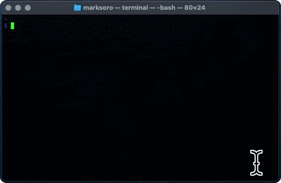

# MO Stay

Get MO Stay availability up to the next two months.

[View the source code](https://github.com/m-soro/mostay/blob/main/mostay)

[Visit Mandarin Oriental Website](https://www.mandarinoriental.com/)

This project was created as a tool make it easier to check MOstay availabilities. Although, Mandarin Oriental's website is beautiful and intuitive. The brand has many popular properties over the world and is not always available for MOStay bookings. 

I built this program using the Selenium and Pillow packages. Selenium is used for browser automation and Pillow is used for screenshot/image processing. 

Here's how I got this started:
1. Visit the website, complete with the date an
